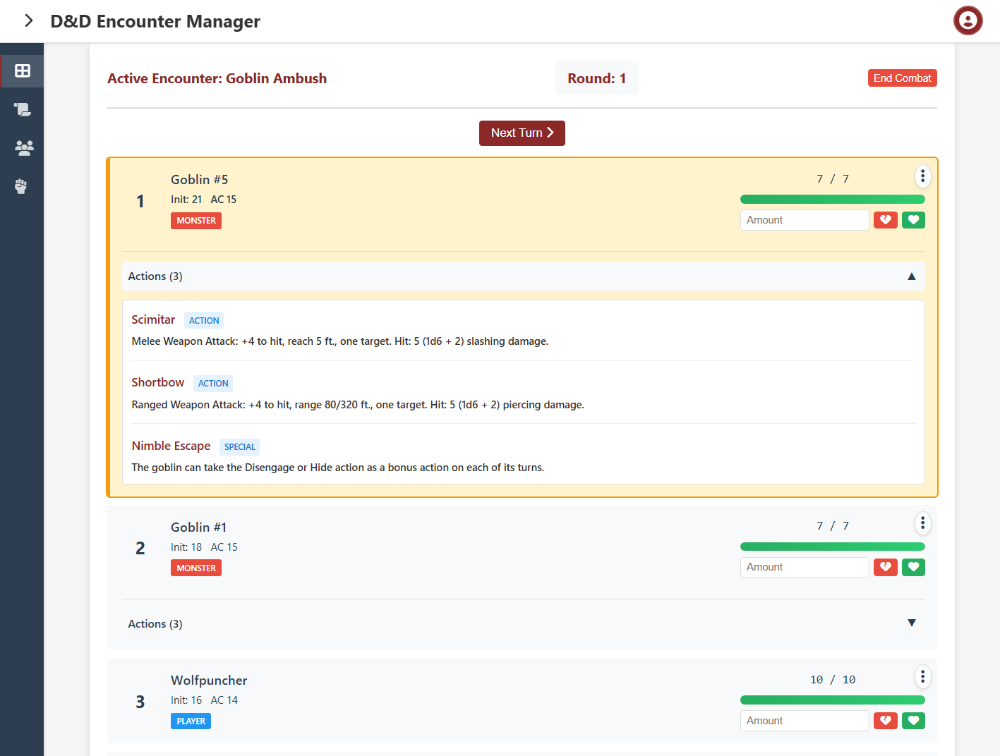

# Encountracker

A web application for managing D&D 5e encounters, featuring initiative tracking, combat management, and campaign organization.

[](https://github.com/jrtex/Encountracker/actions/workflows/ci.yml)



## Disclaimer

This application is built primarily using AI coding tools. This project is intended as a learning project while providing useful functionality for personal hobbies. While safety is taken into account as part of the development of this application, security is not guaranteed. Run this application at your own risk.

## Features

- **Self-hosted/containerized environment**: Run this application securely in your own environment, using Docker, for dungeon masters and players to access
- **Campaign Management**: Organize your D&D campaigns and encounters
- **Initiative Tracker**: Track turn order and combat state
- **Player Management**: Manage player characters and their stats
- **Monster Database**: Store and manage monster stats and special actions
- **DM/Player view**: Allow players to track encounters without spoiling surprises using the public encounter view

## Quick Start - Automated Installation

The easiest way to install the application is to use the installation scripts that guide you through the entire setup process.

### Linux/macOS

```bash
# Make the script executable
chmod +x install.sh

# Run the installation script
./install.sh
```

### Windows

```powershell
# Run PowerShell as Administrator, then execute:
.\install.ps1
```

### Option selections

The automated scripts will check whether all the prerequisites are installed, depending on the choice selected. You will be 
prompted to choose:
- Deployment method: local or Docker
- Create a new storage database or connect to an existing one

The automated scripts will:
- Automatically generate secure JWT secrets
- Create your `.env` configuration file
- Install dependencies and initialize the database
- Start the application

## Getting Started

After installation completes, you can access the application at http://localhost:3000 with the default admin credentials:
- **Username**: `admin`
- **Password**: `admin123`

**IMPORTANT**: Change the admin password immediately after first login!

### Prepare your campaign

As _Dungeon Master_, the first step is to create a campaign. Go to the __Campaigns__ page to create your campaign, and provide some basic information. The first campaign will automatically become the active campaign. You may create as many campaigns as you need.

Each campaign needs some main characters. Go to the __Players__ page to register the characters that your players will play, and add them to the active campaign. You can select a class, provide some basic stats, and give a description of that character.

### Prepare encounters

Campaigns are defined by their legendary fights. Go to the __Encounter__ page to create a new encounter. Then, add some monsters: you can create your own custom monsters, or import them from the _Dungeons and Dragons 5e_ API.

You may prepare as many encounters as you need for your campaign.

### Roll initiative

When the time is right, begin your encounter from the __Dashboard__. Each player will need to roll initiative, although you can roll from the UI if needed. Monsters' initiative is rolled automatically. The turn order is determined from all the rolls, and the encounter may start.

### Track the encounter

While you manage the turns and track the combatants' health and status effects behind your DM screen, your players can follow the encounter by checking the public encounter dashboard at `<url>/public`, where the following info is obfuscated:

- Monster HP
- Monster Actions
- Death Roll status

Good luck, players!

---

## Manual Installation

If you prefer manual installation or need more control over the setup process, follow the instructions below.

### Docker Installation

Docker is the easiest way to get Encountracker up and running. This method handles all dependencies automatically, including the PostgreSQL database.

#### Requirements

- [Docker](https://docs.docker.com/get-docker/) (version 20.10 or higher)
- [Docker Compose](https://docs.docker.com/compose/install/) (usually included with Docker Desktop)

#### Setup Steps

1. **Clone the repository** (or download and extract the ZIP file):
   ```bash
   git clone <repository-url>
   cd encountracker
   ```

2. **Create environment file**:
   ```bash
   cp .env.example .env
   ```

3. **Configure your environment** by editing `.env`:

   **Required settings** (MUST be changed for security):
   ```env
   # Database password (CHANGE THIS!)
   POSTGRES_PASSWORD=your_secure_password_here

   # JWT secret for authentication (CHANGE THIS!)
   JWT_SECRET=your_random_secret_key_here
   ```

   **Optional settings** (can leave as defaults):
   ```env
   # Server port (default: 3000)
   PORT=3000

   # Database configuration (usually don't need to change these)
   POSTGRES_DB=encountracker
   POSTGRES_USER=encountracker_user

   # JWT token expiration (default: 24 hours)
   JWT_EXPIRES_IN=24h

   # CORS origin (set to your domain in production, or * for all)
   CORS_ORIGIN=*

   # Base URL path (for reverse proxy/subdirectory hosting)
   BASE_URL_PATH=/

   # Logging level (info, debug, warn, error)
   LOG_LEVEL=info

   # Rate limiting
   RATE_LIMIT_WINDOW_MS=900000
   RATE_LIMIT_MAX_REQUESTS=10000
   ```

4. **Start the application**:
   ```bash
   docker compose up -d
   ```

   This command will:
   - Download the required Docker images (PostgreSQL and Node.js)
   - Build the application container
   - Start both the database and application
   - Initialize the database with default schema
   - Create a default admin user

5. **Access the application**:
   - Open your browser to http://localhost:3000 (or your configured PORT)
   - Login with default credentials:
     - Username: `admin`
     - Password: `admin123`

6. **Change the admin password** (IMPORTANT - do this immediately):
   ```bash
   # If using Docker:
   docker compose exec app npm run update-admin-password

   # If using local development:
   npm run update-admin-password
   ```

   Follow the prompts to set a secure password. Strong passwords are recommended (8+ characters with uppercase, lowercase, and numbers).

#### Docker Management Commands

```bash
# View logs
docker compose logs -f

# Stop the application
docker compose down

# Update to latest code (after pulling changes)
docker compose down
docker compose up --build -d

# Restart the application (without rebuilding)
docker compose restart

# Remove everything including data (⚠️ WARNING: Destroys all data!)
docker compose down -v
```

#### Updating the Application

When you pull new code or update the application:

```bash
# Stop current containers
docker compose down

# Rebuild and start with latest code
docker compose up --build -d
```

**Why rebuild is needed**: Docker caches images for performance. Without `--build`, it will reuse the old cached image and your code changes won't appear.

## Security Considerations

**Before using in production**:

1. **Change default admin password**: Run `npm run update-admin-password` immediately after installation
   - Docker: `docker compose exec app npm run update-admin-password`
   - Local: `npm run update-admin-password`
2. **Set strong JWT secret**: Use a random, long string for `JWT_SECRET` in `.env`
3. **Use secure database password**: Set a strong `POSTGRES_PASSWORD` in `.env`
4. **Configure CORS**: Set `CORS_ORIGIN` to your domain (not `*`)
5. **Use HTTPS**: Deploy behind a reverse proxy with SSL/TLS (nginx, Caddy, Traefik)
6. **Review rate limits**: Adjust based on your expected traffic
7. **Keep Docker images updated**: Regularly rebuild to get security patches

## License

MIT

